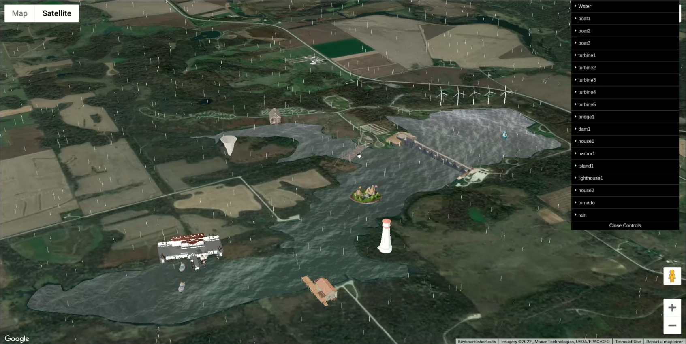

# Hydro3DJS: A Modular Web-Based Library for Real-Time 3D Visualization of Watershed Dynamics and Digital Twin Integration

[](LICENSE)

An interactive, browser-based visualization tool for rendering real-time hydrological phenomena such as rainfall, flooding, and infrastructure exposure. Built with digital twin concepts and geospatial data integration.

---

## Table of Contents
- [Overview](#overview)
- [Features](#features)
- [Screenshots](#screenshots)
- [Getting Started](#getting-started)
- [Quick Start](#quick-start)
- [API Documentation](#api-documentation)
- [Advanced Usage](#advanced-usage)
- [Customization](#customization)
- [Supported Browsers](#supported-browsers)
- [Dependencies](#dependencies)
- [File Structure](#file-structure)
- [Development](#development)
- [Contributing](#contributing)
- [License](#license)
- [Acknowledgements](#acknowledgements)

---

## Overview
Hydro3DJS is a JavaScript library for dynamic 3D visualization of water-related events in a geographic context. Built using **WebGL**, **Google Maps API**, and modern web technologies, it supports integration with real-time hydrological datasets (e.g., **USGS**, **NOAA**) and allows rendering of:
- Rainfall animations  
- Flood zones  
- River paths  
- Infrastructure (e.g., dams, gauges, turbines)

---

## Features
- `addWater(geojson)` – Adds animated floodwater to GeoJSON polygons  
- `addRain(geojson)` – Renders dynamic rainfall animations  
- `addModel(modelPath)` – Loads GLTF/GLB/OBJ/FBX models to specific locations  
- `addTurbine()`, `addStaticBoat()`, `addTravelBoat()` – Specialized 3D objects  
- Object control: `.setPos()`, `.setRot()`, `.setScale()`  
- `highlightCenter()` – Marks center of map view  
- Real-time data overlay (e.g., USGS sensors)  
- Fully browser-compatible (no plugins required)  
- Modular architecture for extendability  

---


## Screenshots

### Rural Watershed Simulation with Custom 3D Elements



### Iowa City Stream Gauge Panel


---

## Getting Started
A fully working example is provided in `core/demo.js`, which demonstrates how to:
- Initialize the 3D map
- Load rainfall and flood data
- Add models (boats, gauges, turbines, etc.)
- Interact with the UI and geospatial overlays

This is the best starting point for developers exploring the capabilities of **Hydro3DJS**.

```bash
cd src
npm install
npm start
```
Then open: [http://localhost:9000](http://localhost:9000)

---

## Quick Start
```js
import { Hydro3DJS } from './core/Hydro3DJS.js';

const hydro = new Hydro3DJS({
  mapOptions: {
    center: { lat: 41.65, lng: -91.54 },
    zoom: 15,
    mapTypeId: 'satellite'
  },
  map: new google.maps.Map(document.getElementById('map'), mapOptions),
  scene: new THREE.Scene(),
  ui: myUIInstance
});

// Add animated water
const floodPolygon = await fetch('./maps/flood_zone.json').then(r => r.json());
hydro.addWater(floodPolygon);

// Add animated rain
const rainGeoJSON = await fetch('./maps/rain_area.json').then(r => r.json());
hydro.addRain(rainGeoJSON);
```

---

## API Documentation
### `Hydro3DJS` Class
#### Constructor
```js
new Hydro3DJS({ mapOptions, map, scene, ui, gui })
```
- `mapOptions`: Google Maps options object
- `map`: Google Maps instance
- `scene`: THREE.js scene
- `ui`: UI manager instance
- `gui`: (optional) dat.GUI instance

#### Methods
- `addWater(geojson, preProcessed = false, alpha = 1.0)` – Add animated water to a GeoJSON polygon.
- `addRain(geojson)` – Add animated rain to a GeoJSON polygon.
- `addModel(name, modelPath)` – Add a 3D model to the scene.
- `addTurbine(name, modelPath)` – Add a wind turbine model.
- `addStaticBoat(name, modelPath)` – Add a static (bobbing) boat.
- `addTravelBoat(name, modelPath)` – Add a boat that follows a path.
- `highlightCenter(enable)` – Highlight or remove the center marker.
- `changeMapCenter(lat, lng, callback)` – Move the map and scene center.
- `animate(time, camPos)` – Animate all objects and water (called in your render loop).

**Example:**
```js
const gauge = hydro.addModel('gauge', 'models/cube/cube.glb');
gauge.setScale(10);
gauge.setPosWLngLat(-91.54, 41.65);
```

---

## Advanced Usage
### Animating Objects
```js
function animate() {
  requestAnimationFrame(animate);
  const time = performance.now() * 0.001;
  hydro.animate(time, camera.position);
}
animate();
```
### Customizing Water Appearance
You can pass custom shader uniforms or modify the water shader in `core/Water.js` and `shaders/water_shader.js`.

---

## Customization
- **UI Panels**: Modify files in `/ui` to customize the control panels and overlays.
- **Textures & Models**: Add your own models to `/models` and textures to `/textures`.
- **Shaders**: Advanced users can edit `/shaders` for custom water/rain effects.

---

## Supported Browsers
✅ Chrome  
✅ Firefox  
✅ Safari  
✅ Edge  
> 💡 For best experience, use latest versions with WebGL support.

---

## Dependencies
- [Three.js](https://threejs.org/)  
- [Google Maps JavaScript API](https://developers.google.com/maps/documentation/javascript)
- [TWEEN.js](https://github.com/tweenjs/tween.js)  
- [Lodash](https://lodash.com/)

---

## File Structure
```
Hydro3DJS/
├── src/
│   ├── core/          # Core engine (Hydro3DJS.js, utils.js, demo.js, watergeo.js, Water.js, overlay.js)
│   ├── maps/          # GeoJSONs and datasets
│   ├── models/        # 3D models (GLTF, FBX)
│   ├── ui/            # UI scripts (panel logic, icon handlers)
│   ├── textures/      # Images and textures
│   ├── shaders/       # Custom shaders
│   ├── style.css      # Main CSS
│   ├── index.html     # Main HTML
│   └── webpack.config.js
```

---

## Development
```bash
cd src
npm install
npm start
```
Then open: [http://localhost:9000](http://localhost:9000)

---

## Contributing
Contributions are welcome! Please open an issue or pull request. For major changes, please open an issue first to discuss what you would like to change.

---

## License
This project is licensed under the MIT License - see the [LICENSE](LICENSE) file for details.

---

## Acknowledgements
This project is developed by the University of Iowa Hydroinformatics Lab (UIHI Lab): [https://hydroinformatics.uiowa.edu/](https://hydroinformatics.uiowa.edu/).

> Sajja, R., Mermet, O., Sermet, Y., & Demir, I. (2025). Scalable 3D visualization of watershed dynamics using digital twin technology.
